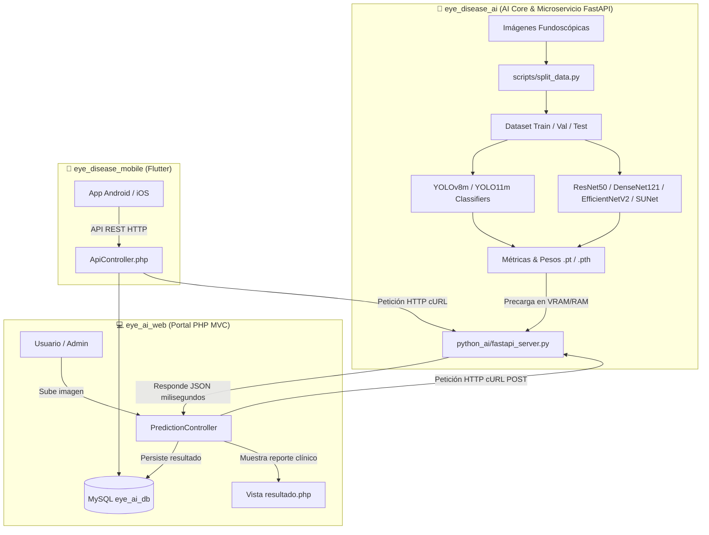

# 👁️ EYES-DISEASE — Sistema Inteligente de Diagnóstico Ocular

[](LICENSE)
[](https://python.org)
[](https://php.net)
[](https://flutter.dev)
[](https://pytorch.org)
[](https://ultralytics.com)
[](https://mysql.com)

Un sistema profesional **end-to-end** de clasificación y detección de patologías oculares a partir de imágenes de fondo de ojo (oftalmoscopio). Este ecosistema integra **6 modelos de Deep Learning** de última generación con una plataforma web interactiva, segura y una **aplicación móvil Flutter** para la gestión de pacientes y diagnósticos en tiempo real.

---

## 🏗️ Arquitectura del Sistema

El ecosistema se divide en **tres componentes** perfectamente integrados:



### 1. `eye_disease_ai` — AI Core & Servidor de Inferencia FastAPI
Módulo de procesamiento, entrenamiento y servidor continuo de inferencia en tiempo real.
- **6 Modelos**: YOLOv8m-cls, YOLO11m-cls, ResNet50, DenseNet121, EfficientNetV2-S, Swin Transformer (SUNet).
- **Pipeline**: Preparación ➔ Data Augmentation ➔ Entrenamiento GPU (AMP + cuDNN) ➔ Evaluación con 3 seeds y TTA.
- **Microservicio FastAPI**: Carga permanente de modelos en memoria GPU/CPU para respuesta ultrasrápida en milisegundos sin latencia de arranque.

### 2. `eye_ai_web` — Portal de Diagnóstico Web (PHP MVC)
Plataforma web profesional bajo el patrón **MVC** en PHP puro, desacoplada del motor de IA.
- **Módulos**: Autenticación JWT-session, Panel Usuario, Historial Clínico, Comparador de Modelos (hasta 6 a la vez), Panel Admin.
- **API REST** (`/api/*`): Endpoints para la app móvil con autenticación basada en tokens de sesión.
- **Inferencia en Tiempo Real**: Comunicación segura y desacoplada vía cliente HTTP cURL hacia el microservicio FastAPI.

### 3. `eye_disease_mobile` — Aplicación Móvil (Flutter)
Aplicación multiplataforma (Android / iOS) que consume la API REST del portal web.
- Captura o selecciona imágenes de fondo de ojo desde la cámara o galería.
- Muestra diagnósticos con nivel de confianza, historial y alertas clínicas.
- Persistencia local con Hive para modo offline.

---

## 📋 Clases Clínicas Detectadas

El sistema analiza imágenes fundoscópicas clasificándolas en **5 categorías**:

| Icono | Patología | Nivel de Riesgo | Descripción Médica |
|:---:|---|:---:|---|
| 👁️‍🗨️ | **Cataract** | 🟡 Moderado | Pérdida de transparencia del cristalino. |
| 🩸 | **Diabetic Retinopathy** | 🔴 Alto | Daño microvascular retinal por diabetes. |
| 🔵 | **Glaucoma** | 🚨 Urgencia Médica | Neuropatía óptica por presión intraocular elevada. |
| 🟠 | **Retina Disease** | 🔴 Alto | Otras patologías y desprendimientos retinales. |
| ✅ | **Normal** | 🟢 Sin riesgo | Ojo sano con estructuras vasculares normales. |

---

## 📊 Resultados Estadísticos Consolidados

El rendimiento se evaluó bajo **3 semillas independientes** (`42`, `123`, `2024`) sobre el conjunto de prueba con **Test-Time Augmentation (TTA)** geométrico de 5 vistas. Las métricas son la **media ± desviación estándar**:

| Arquitectura | Accuracy (%) | F1-Score Pond. (%) | AUC-ROC Macro | Latencia TTA (ms/img) |
| :--- | :---: | :---: | :---: | :---: |
| **🥇 YOLO11m-cls** | **90.24 ± 0.31** | **90.22 ± 0.30** | **0.976 ± 0.004** | 37.7 ± 0.4 ms |
| **🥈 ResNet50** | 88.85 ± 0.44 | 88.95 ± 0.42 | 0.968 ± 0.006 | **18.4 ± 0.5 ms** |
| **🥉 YOLOv8m-cls** | 88.02 ± 0.52 | 88.03 ± 0.50 | 0.961 ± 0.005 | 26.6 ± 0.0 ms |
| **Swin Transformer (SUNet)** | 85.93 ± 0.61 | 86.15 ± 0.59 | 0.952 ± 0.007 | 32.4 ± 0.2 ms |
| **DenseNet121** | 81.48 ± 0.73 | 81.41 ± 0.72 | 0.934 ± 0.009 | 39.3 ± 0.3 ms |
| **EfficientNetV2-S** | 66.72 ± 1.21 | 66.83 ± 1.20 | 0.881 ± 0.014 | 41.7 ± 0.1 ms |

### 📈 F1-Score por Clase (YOLO11m — mejor modelo)

| Patología | F1-Score (%) |
|---|:---:|
| Diabetic Retinopathy | **93.0 ± 0.30** |
| Cataract | 91.0 ± 0.40 |
| Glaucoma | 90.0 ± 0.50 |
| Normal | 86.0 ± 0.60 |
| Retina Disease | 78.0 ± 5.00 |

> **💡 Hallazgos clave:**
> - **YOLO11m** logra el mejor balance general con 90.24% de exactitud y AUC-ROC de 0.976.
> - **ResNet50** destaca por su velocidad de inferencia (18.4 ms) con métricas muy competitivas.
> - Todos los modelos top-4 superan el **0.95 AUC-ROC**, indicando excelente capacidad discriminativa.

---

## 🚀 Requisitos Técnicos

### Hardware (Entrenamiento AI)
- **GPU**: NVIDIA con CUDA 12.4+ (probado en RTX 5060 Ti 16 GB VRAM).
- **RAM**: Mínimo 16 GB.
- **Almacenamiento**: ~20 GB para dataset + modelos.

### Servidor (Portal Web)
- **PHP**: 8.2 o superior con extensión PDO MySQL.
- **Base de Datos**: MySQL 8.0+ o MariaDB 10.5+.
- **Servidor Web**: Apache (mod_rewrite) o Nginx — o PHP built-in server para desarrollo.

### App Móvil
- **Flutter**: SDK 3.x+.
- **Dart**: 3.x+.
- Dispositivo Android 6.0+ o iOS 12+.

---

## 📦 Instalación

### 1️⃣ AI Core (`eye_disease_ai`)

```powershell
# Crear entorno virtual
cd D:\MODELO_EYES\eye_disease_ai
python -m venv venv
.\venv\Scripts\Activate.ps1

# Instalar PyTorch con CUDA 12.4
pip install torch torchvision --index-url https://download.pytorch.org/whl/cu124

# Instalar dependencias del proyecto
pip install -r requirements.txt
```

#### Preparar dataset y entrenar modelos:

```powershell
# Dividir dataset en Train/Val/Test (70/15/15)
python scripts/split_data.py

# Entrenar modelos (cada uno independiente)
python scripts/train_yolo11.py       # Mejor modelo
python scripts/train_yolov8.py
python scripts/train_resnet.py
python scripts/train_densenet.py
python scripts/train_efficientnet.py
python scripts/train_sunet.py

# Generar métricas consolidadas y dashboard visual
python scripts/calculate_global_metrics.py
python scripts/generate_results_dashboard.py
```

---

### 2️⃣ Servidor de IA & Portal Web (`eye_ai_web`)

#### Paso A: Iniciar el Microservicio de IA (FastAPI)

```powershell
# Activar entorno e iniciar servidor FastAPI
cd D:\MODELO_EYES\eye_ai_web\python_ai
..\..\eye_disease_ai\venv\Scripts\python.exe fastapi_server.py
```
*El servidor se iniciará en `http://127.0.0.1:8000` precargando los 6 modelos en memoria GPU/CPU.*

#### Paso B: Iniciar el Portal Web PHP

##### Opción 1: Servidor PHP integrado (desarrollo rápido)

```powershell
cd D:\MODELO_EYES\eye_ai_web

# Inicializar la base de datos (solo la primera vez)
php setup_db.php

# Iniciar servidor web en puerto 8080
php -S localhost:8080 router.php
```

Accede a **http://localhost:8080** y usa las credenciales:
- **Correo**: `admin@eyeai.com`
- **Contraseña**: `Admin123!`

##### Opción 2: Apache / XAMPP

1. Copia la carpeta `eye_ai_web/` a `htdocs/`.
2. Importa el schema: `mysql -u root < eye_ai_web/database/eye_ai.sql`
3. Accede a `http://localhost/eye_ai_web/`

---

### 3️⃣ App Móvil (`eye_disease_mobile`)

```bash
cd D:\MODELO_EYES\eye_disease_mobile
flutter pub get

# Ajustar la URL del servidor en lib/services/api_service.dart
# Cambiar BASE_URL a la IP de tu servidor local (ej. http://192.168.x.x:8000)

flutter run
```

---

## ⚡ Optimizaciones Aplicadas

| Optimización | Descripción |
|---|---|
| **Microservicio FastAPI** | Carga permanente de los 6 modelos en memoria GPU/CPU, reduciendo latencia y eliminando el overhead de shell_exec. |
| **Mixed Precision (AMP)** | Reduce VRAM ~50% con float16, acelerando la inferencia GPU. |
| **cuDNN Auto-Tuning** | Benchmark automático de kernels de convolución óptimos. |
| **Test-Time Augmentation** | Ensemble de 5 vistas geométricas para mayor robustez. |
| **Multi-Seed Evaluation** | Validación con 3 semillas para reportes estadísticos confiables. |
| **MVC Limpio (PHP)** | Separación estricta de responsabilidades sin frameworks pesados. |
| **PDO Prepared Statements** | Protección total contra inyección SQL. |
| **CSRF Protection** | Tokens anti-CSRF en todos los formularios. |
| **Bcrypt Hashing** | Contraseñas con cost factor 10 para máxima seguridad. |
| **Hive (Flutter)** | Persistencia local cifrada para modo offline en la app móvil. |

---

## 🗂️ Estructura del Proyecto

```
MODELO_EYES/
├── 📂 eye_disease_ai/          # AI Core — Entrenamiento y evaluación
│   ├── scripts/                # Scripts de entrenamiento y métricas
│   ├── models/                 # Pesos entrenados (.pth, .pt)
│   ├── results/                # Matrices de confusión, métricas JSON, gráficas
│   └── requirements.txt
│
├── 📂 eye_ai_web/              # Portal Web PHP MVC
│   ├── config/                 # Configuración global, DB, sesiones
│   ├── controllers/            # AuthController, UserController, PredictionController, ApiController
│   ├── models/                 # Database (PDO Singleton), User, Prediction
│   ├── views/                  # Vistas PHP (auth, user, admin, errors)
│   ├── python_ai/              # fastapi_server.py — Microservicio API REST FastAPI (Inferencia en RAM/VRAM)
│   ├── routes/                 # web.php — definición de rutas MVC
│   ├── assets/                 # CSS, JS
│   ├── database/               # eye_ai.sql — schema completo
│   └── router.php              # Router para servidor PHP integrado
│
└── 📂 eye_disease_mobile/      # App Móvil Flutter
    ├── lib/
    │   ├── services/           # ApiService, HistoryService (Hive)
    │   └── main.dart
    └── pubspec.yaml
```

---

## 📄 Licencia y Uso

Este software se distribuye exclusivamente bajo licencia de **Investigación Científica y Uso Educativo**.

> ⚠️ **Advertencia Clínica**: Este sistema es una herramienta de apoyo diagnóstico. No debe utilizarse como diagnóstico clínico único sin la supervisión y validación de un profesional oftalmólogo certificado. Los resultados de la IA son orientativos y complementarios a la evaluación médica formal.