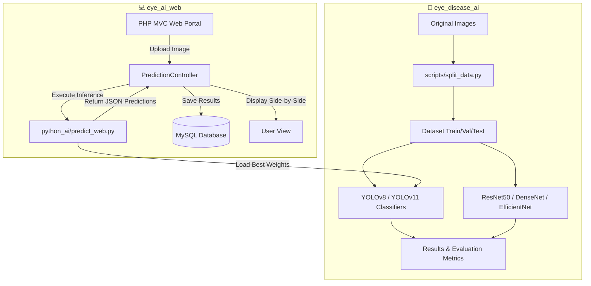

# 👁️ EYES-DISEASE — Sistema Inteligente de Diagnóstico Ocular

[](LICENSE)
[](https://python.org)
[](https://php.net)
[](https://pytorch.org)
[](https://ultralytics.com)
[](https://mysql.com)

Un sistema profesional end-to-end de clasificación y detección de patologías oculares a partir de imágenes de fondo de ojo (oftalmoscopio). Este ecosistema integra modelos de Deep Learning de última generación con una plataforma web interactiva y segura para la gestión de pacientes y diagnósticos en tiempo real.

---

## 🏗️ Arquitectura del Sistema

El ecosistema se divide en dos componentes principales perfectamente integrados:



### 1. `eye_disease_ai` (AI Core & Scripts de Entrenamiento)
Módulo encargado del procesamiento, entrenamiento, validación y comparación de modelos de Deep Learning.
- **Modelos Soportados**: YOLOv8, YOLOv11, ResNet50, DenseNet, EfficientNet, SUNet.
- **Flujo de Trabajo**: Preparación de datos ➔ Aumento de datos ➔ Entrenamiento en GPU ➔ Evaluación de métricas avanzadas (Accuracy, F1-Score, Matriz de Confusión).

### 2. `eye_ai_web` (Portal de Gestión y Diagnóstico Web)
Plataforma web profesional estructurada bajo el patrón **MVC (Modelo-Vista-Controlador)** en PHP vainilla, sin dependencias externas pesadas.
- **Módulos**: Autenticación segura, Panel de Usuario, Historial Clínico de Predicciones, Comparador de Modelos, Panel Administrativo completo para gestionar usuarios y monitorear logs.
- **Inferencia en Caliente**: Conexión directa mediante llamadas a scripts en segundo plano con PyTorch para la predicción inmediata de imágenes subidas por el usuario.

---

## 📋 Clases Clínicas Detectadas

El sistema analiza imágenes fundoscópicas clasificándolas en 5 categorías fundamentales:

| Icono | Patología | Descripción Médica |
|:---:|---|---|
| 👁️‍🗨️ | **Cataract** | Pérdida de transparencia del cristalino que disminuye la visión. |
| 🩸 | **Diabetic Retinopathy** | Daño microvascular en la retina debido a complicaciones de la diabetes. |
| 🩺 | **Glaucoma** | Neuropatía óptica progresiva asociada a elevación de la presión intraocular. |
| 🩹 | **Retina Disease** | Otras patologías y desprendimientos en el tejido retinal. |
| ✅ | **Normal** | Ojo sano con estructuras vasculares, mácula y disco óptico normales. |

---

## 🚀 Requisitos Técnicos

### Requisitos de Hardware (Entrenamiento AI)
* **GPU**: NVIDIA RTX 5060 (16 GB VRAM recomendado, soporte CUDA 12.4).
* **RAM**: Mínimo 16 GB.
* **CPU**: Procesador moderno de 6+ núcleos.

### Requisitos de Servidor (Portal Web)
* **PHP**: Versión 8.1 o superior.
* **Base de Datos**: MySQL o MariaDB.
* **Servidor Web**: Apache (con módulo `rewrite` activo) o Nginx.
* **Entorno Local**: Compatible con XAMPP / Laragon.

---

## 📦 Instalación y Configuración del AI Core (`eye_disease_ai`)

### 1. Preparar el Entorno Virtual
Asegúrate de estar en el directorio raíz de la inteligencia artificial:
```powershell
cd D:\MODELO_EYES\eye_disease_ai
python -m venv venv
.\venv\Scripts\Activate.ps1
```

### 2. Instalar Dependencias con Aceleración CUDA
Instala PyTorch optimizado para tarjetas NVIDIA RTX y luego instala el resto de dependencias de visión artificial:
```powershell
# Instalar PyTorch con CUDA 12.4
pip install torch torchvision --index-url https://download.pytorch.org/whl/cu124

# Instalar dependencias del proyecto
pip install -r requirements.txt
```

### 3. Preparación y División del Dataset
Para entrenar los modelos, coloca tus imágenes en `raw_data/` en subcarpetas según cada clase, luego ejecuta:
```powershell
# Crear estructura de carpetas
python scripts/setup_folders.py

# Dividir dataset en conjuntos de entrenamiento, validación y prueba (70/15/15)
python scripts/split_data.py
```

### 4. Entrenamiento y Evaluación
Puedes entrenar los clasificadores con un solo comando:
```powershell
# Entrenar YOLOv8 Classification
python scripts/train_yolov8.py

# Entrenar YOLOv11 Classification
python scripts/train_yolo11.py

# Entrenar ResNet50
python scripts/train_resnet.py

# Evaluar y comparar modelos generados
python scripts/evaluate.py
```

---

## 💻 Instalación y Configuración del Portal Web (`eye_ai_web`)

### 1. Configurar Base de Datos MySQL
1. Inicia tu servidor local de base de datos (por ejemplo MySQL en XAMPP).
2. Importa el archivo SQL para inicializar el esquema de tablas, roles y el usuario administrador inicial:
   ```bash
   mysql -u root -p < eye_ai_web/database/eye_ai.sql
   ```
3. La configuración por defecto se encuentra en `eye_ai_web/config/database.php`. Modifica el usuario y contraseña si es necesario.

### 2. Acceso Inicial a la Plataforma
El script SQL creará por defecto una cuenta de Administrador con los siguientes datos de acceso:
* **URL**: `http://localhost/eye_ai_web/`
* **Correo Electrónico**: `admin@eyeai.com`
* **Contraseña**: `Admin123!`

---

## ⚡ Optimizaciones Aplicadas
* **Mixed Precision (AMP)**: Reducción del uso de VRAM de GPU en un 50% con aceleración en operaciones de punto flotante de 16-bits.
* **cuDNN Auto-Tuning**: Benchmark automático para encontrar los kernels de convolución más rápidos en la GPU disponible.
* **Estructura MVC Limpia**: Separación estricta de responsabilidades en PHP que garantiza rapidez y facilidad de mantenimiento.
* **Seguridad Incorporada**: Prevención de inyección SQL mediante consultas preparadas PDO, sanitización de entradas, protección contra ataques CSRF y hashes seguros para contraseñas (`PASSWORD_BCRYPT`).

---

## 📄 Licencia y Uso
Este software se distribuye exclusivamente bajo licencia de **Investigación Científica y Uso Educativo**. No se recomienda su empleo como diagnóstico clínico único sin la supervisión y validación de un profesional oftalmólogo matriculado.